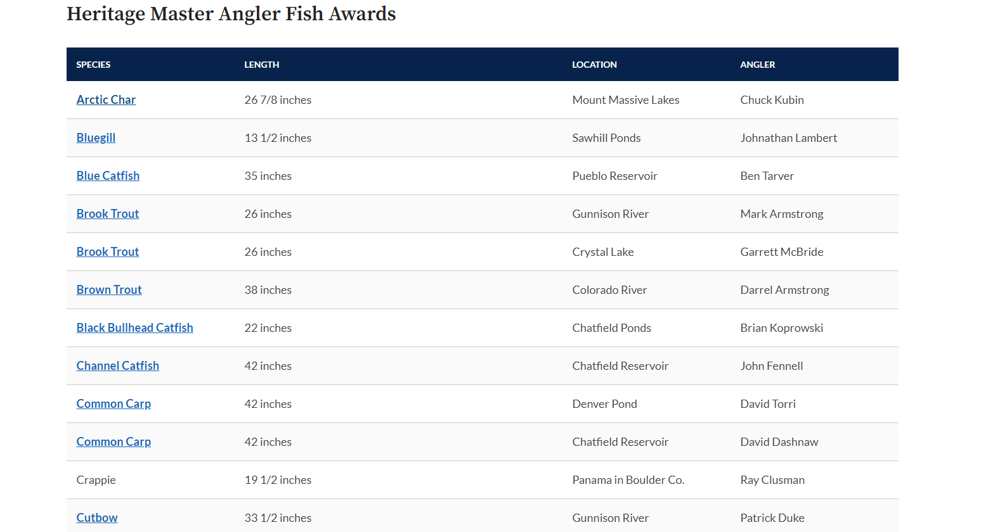
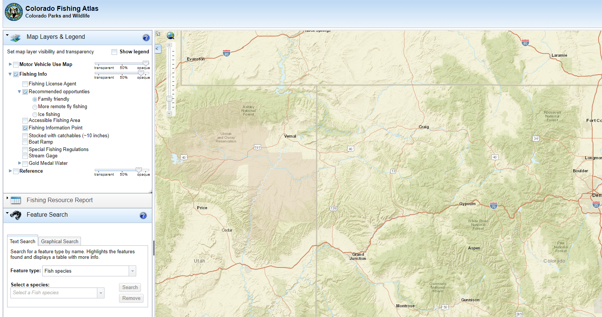

# Fishing Trip Planner

The goal of this project is to webscrape, clean, and then store website data in snowflake. Then the data can be shown in a dashboard or for analytics to plan fishing trips.

## Data Sources

### Master Angler Awards

Colorado Parks and Wildlife (CPW) used to display every single submission in a table. Each submission was of a trophy fish someone caught. Now they show only one record per fish.

### Colorado Fishing Atlas

CPW has an interactive map that can be used to see what types of fish exist in each body of water.

## Data Storage

After the data was scraped and cleaned it was then stored in a [Snowflake database](https://www.snowflake.com/en/).
